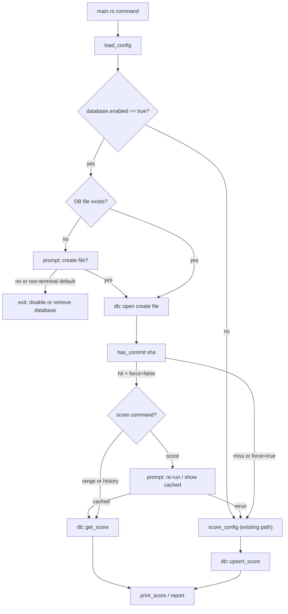

## High-level

Add an optional `[database]` section to `fiber.toml`. **Database use is opt-in:** only when `enabled = true` does fiber open SQLite, read/write the cache, and persist scores. If `[database]` is absent, or `enabled` is absent or `false`, behavior matches today: **no DB I/O** (no connection, no file creation). The `fiber` crate still links `rusqlite` at build time (same as today’s plan); the user-facing guarantee is **runtime** gating so non-DB workflows are unchanged.

When the database is active (`enabled = true` and a resolved DB file path is in use), every successful score (from `score`, `range`, or `history`) is stored in SQLite keyed by commit hash. Each row stores the full `HealthScore` JSON, the `MetricConfig` array JSON, and the config-file path used.

- **`path` default:** if `path` is omitted (or null) under `[database]`, treat it as **`fiber.db`** relative to the **current working directory** (same base as relative globs). If `path` is set, it is still resolved relative to the CWD.

- **Missing DB file:** before first open, if the path has no file yet, **prompt** whether to create it. **Decline (or non-interactive equivalent):** do **not** run scoring or range/history work — **exit** with a non-zero status and a message telling the user to either set `enabled = false` or remove the `[database]` section entirely if they do not want to use a database. **Accept** → create the file (and parent directories if needed), then continue.
- `fiber score`: if the current commit is already in the DB, prompt the user to re-run or display the cached row.
- `fiber range` / `fiber history`: silently reuse cached rows (skip `git checkout` + metric execution for cached commits).
- All three commands accept `--force` to bypass the cache and overwrite.

Example (minimal — uses `./fiber.db` in the process CWD):

```toml
[database]
enabled = true
```

Example with an explicit path:

```toml
[database]
enabled = true
path = "./fiber.db"
```

## Data flow



## Schema

Single table, JSON blobs for fidelity, plus a couple of indexed scalar columns for cheap inspection.

```sql
CREATE TABLE IF NOT EXISTS scores (
    commit_hash   TEXT PRIMARY KEY,
    config_path   TEXT NOT NULL,
    -- Unix seconds UTC; MUST equal HealthScore.timestamp (same instant as inside health_score JSON)
    timestamp     INTEGER NOT NULL,
    overall       REAL NOT NULL,
    health_score  TEXT NOT NULL,
    metric_config TEXT NOT NULL,
    created_at    INTEGER NOT NULL DEFAULT (strftime('%s', 'now'))
);
```

`timestamp` is **not** “now at insert time”: on every `upsert_score`, set it from `score.timestamp` (e.g. `score.timestamp.timestamp()`), so the column always matches the serialized `HealthScore`’s `timestamp` field. `created_at` remains when the row was first written (default); on `ON CONFLICT DO UPDATE`, either leave `created_at` unchanged (only update the other columns) or document explicitly—prefer **not** updating `created_at` on upsert so it stays first-insert time while `timestamp` tracks the score’s logical time.

Writes use `INSERT ... ON CONFLICT(commit_hash) DO UPDATE` so re-runs overwrite cleanly (including refreshing `timestamp` from the new `score.timestamp`). `health_score` and `metric_config` are `serde_json::to_string` of the respective Rust types. When the database is active, the DB file path is `cwd.join(relative_path)` where `relative_path` is `database.path` from config or **`fiber.db`** if `path` was omitted.

- [fiber/Cargo.toml](fiber/Cargo.toml): add `rusqlite = { version = "*", features = ["bundled"] }` (latest stable; `bundled` avoids requiring system libsqlite3).
- [fiber/src/config.rs](fiber/src/config.rs): add a single `[database]` table with **`enabled` defaulting to `false`** (`#[serde(default)]` on a `bool` field, or `Option<bool>` normalized to `false` when missing).

```rust
#[derive(Debug, Deserialize, Serialize, Clone)]
pub struct DatabaseConfig {
    #[serde(default)]
    pub enabled: bool,
    /// Omitted in TOML → `None`; resolve with `path.as_deref().unwrap_or("fiber.db")` against CWD.
    #[serde(default)]
    pub path: Option<String>,
}

#[derive(Debug, Deserialize)]
pub struct Config {
    #[serde(default)]
    pub metrics: Vec<MetricConfig>,
    pub database: Option<DatabaseConfig>,
}
```

No extra validation in `load_config` for “path required when enabled”: `enabled = true` with no `path` key is valid and resolves to **`fiber.db`** in the CWD. When `enabled` is false, ignore `path` for I/O.

Also add `Serialize` to `MetricConfig` so the metric snapshot can be persisted.

**Effective “use database” predicate:** `config.database.as_ref().is_some_and(|d| d.enabled)` **and** either the DB file already exists, or the user **accepted** the create-file prompt — yielding an open `Db`. If `enabled = true` but the file is missing and the user declines, or **`is_terminal` is false** so the create-file prompt short-circuits to Quit (see below), the process **exits** before any scoring; there is no “run without DB” fallback while the config still requests a database.

- [fiber/src/scorer.rs](fiber/src/scorer.rs) and [fiber/src/metrics/mod.rs](fiber/src/metrics/mod.rs): add `Deserialize` next to the existing `Serialize` derives on `HealthScore`, `PenaltyNode`, and `MetricResult`. (`HashMap<String, f64>`, `Vec<MetricResult>`, `DateTime<Utc>`, `Option<String>` all already round-trip through serde_json.)

- [fiber/src/error.rs](fiber/src/error.rs): add `Db(String)` variant for clean error categorization (and a `From<rusqlite::Error>` or use `anyhow::Context` at boundaries).

- **New** `fiber/src/db.rs`: thin wrapper around `rusqlite::Connection`. Public API:

```rust
pub struct Db { /* conn: Connection */ }

impl Db {
    /// Opens an existing file or creates it; caller must only invoke after user approved create-if-missing.
    /// Immediately runs `PRAGMA journal_mode=WAL` and `PRAGMA busy_timeout=1000` on the connection (WAL for
    /// normal SQLite concurrency; busy_timeout so concurrent fiber processes wait briefly on locks instead of failing).
    pub fn open(path: &str) -> Result<Self>;
    pub fn has_commit(&self, sha: &str) -> Result<bool>;
    pub fn get_score(&self, sha: &str) -> Result<Option<HealthScore>>;
    /// Persists `health_score` JSON and sets the `timestamp` column from `score.timestamp` (same instant as in JSON; not wall-clock insert time).
    pub fn upsert_score(
        &self,
        sha: &str,
        config_path: &str,
        score: &HealthScore,
        metrics: &[MetricConfig],
    ) -> Result<()>;
}

`open` obtains a `rusqlite::Connection`, then **before** other use runs `PRAGMA journal_mode=WAL` and `PRAGMA busy_timeout=1000` (milliseconds; use `execute_batch` and/or `pragma_update` as fits rusqlite). Then run `CREATE TABLE IF NOT EXISTS` once for implicit migration. Internally stores JSON via `serde_json::{to_string, from_str}`. If WAL cannot be enabled (unusual FS), propagate the SQLite error with context.

**Helper:** e.g. `fn resolved_db_path(database: &DatabaseConfig) -> PathBuf` — `std::env::current_dir()` (or the same working-dir buffer used for metrics) joined with `database.path.as_deref().unwrap_or("fiber.db")`. `std::path::Path::exists` on that file drives the create prompt.

- [fiber/src/lib.rs](fiber/src/lib.rs): add `pub mod db;`.

- [fiber/src/cli.rs](fiber/src/cli.rs): add `--force` to all three subcommands (skip cache check, always recompute, overwrite DB row).

- [fiber/src/main.rs](fiber/src/main.rs): the substantive wiring.
  - Refactor `score_config` to accept an already-loaded `Config` to avoid double-loading.
  - **Opening the DB (shared helper used by score / range / history):** if `!database.enabled`, return `None` (no prompts, no I/O). If `enabled`, resolve the DB file to `cwd.join(database.path.as_deref().unwrap_or("fiber.db"))`; if the file does not exist, call `prompt_create_database_file(path, stdin, stdout, std::io::stdin().is_terminal())` — when `is_terminal` is **false**, **do not read stdin** — return Quit immediately (same as decline: print instructional message and exit non-zero); when **true**, prompt `(c)reate / (q)uit [q]`; on **decline**, print the instructional message and **`std::process::exit` non-zero** or return `Err` from `main` so the subcommand does not run; on **accept**, `fs::create_dir_all` parent then `Db::open` (create file). If the file already exists, open without prompting.
  - `run_score_command(config_path, force)`:
    1. Load config; compute `commit = git::get_current_commit().ok()` and `timestamp = Utc::now()`.
    2. If `Db` is `Some` for this run and `commit` is `Some` and `!force` and `db.has_commit(sha)?`, call `prompt_cached_action(sha, stdin, stdout, std::io::stdin().is_terminal())`: when `is_terminal` is **false**, **do not read stdin** — return `ShowCached` immediately; when **true**, prompt as below (empty line defaults to `ShowCached`).
    3. If the user picks "show cached", return `db.get_score(sha)?`.
    4. Otherwise run metrics and, if `Db` is `Some` and commit is known, `db.upsert_score(...)`.
  - `score_commits(commits, &config, config_path, db: Option<&Db>, force)`:
    - For each commit, when `db` is `Some` and not `force` and `has_commit(sha)`, push `db.get_score(sha)?` and skip the checkout entirely.
    - Otherwise capture `head_ref` lazily on first miss, check out, run, upsert. Always `restore_head` if any checkout happened.
  - `run_range_command` / `run_history_command` accept and thread `force` and the opened `Db`.

- [fiber/fiber.example.toml](fiber/fiber.example.toml) and [README.md](README.md): document `[database]` with `enabled`, optional `path` (default **`fiber.db`** in CWD), the missing-file create prompt (decline exits with instructions to set `enabled = false` or remove `[database]`), `--force`, and the `score` cache prompt.

## Prompt behavior

Isolate I/O so decision logic stays testable (same pattern as cache re-run).

### Create missing database file

When `enabled = true` and the resolved path has **no file** yet:

```rust
enum CreateDbFile { Yes, No }
fn prompt_create_database_file<R: BufRead, W: Write>(
    path: &Path,
    stdin: &mut R,
    stdout: &mut W,
    is_terminal: bool,
) -> Result<CreateDbFile>;
```

When `is_terminal` is **false**, return `No` (Quit) **immediately** without reading stdin — same exit path as an explicit decline (scripts/CI never hang waiting for input).

Suggested wording when `is_terminal` is **true**: `Database file <path> does not exist. (c)reate it / (q)uit [q]:` — **default quit** on empty line. On decline or default quit, print something like: *Fiber is configured to use a database but the file does not exist. Set `enabled = false` under `[database]` or remove the `[database]` section from your config if you do not want to use a database, then run again.* If the user chooses create, ensure parent directory exists (`fs::create_dir_all`) before `rusqlite::Connection::open`.

### Cached commit (`fiber score` only)

```rust
enum CachedAction { ShowCached, ReRun }
fn prompt_cached_action<R: BufRead, W: Write>(
    sha: &str,
    stdin: &mut R,
    stdout: &mut W,
    is_terminal: bool,
) -> Result<CachedAction>;
```

**Terminal gating:** `main` passes `is_terminal: std::io::stdin().is_terminal()` (do **not** call `is_terminal()` inside the prompt helpers — keeps them pure and easy to test). When `is_terminal` is **false**, **skip the prompt** and return **`ShowCached` immediately** without reading stdin. When `is_terminal` is **true**, print the prompt and read a line; empty line defaults to `ShowCached`.

Wording (interactive only): `Commit <short>: cached score found. (s)how cached / (r)e-run [s]:`. `main` uses `stdin().lock()` and `stdout().lock()` for the actual I/O handles.

## Trade-offs and notes

- **Schema simplicity over normalization**: storing `HealthScore` as JSON keeps round-trips lossless and avoids a schema migration every time `PenaltyNode` or `MetricResult` evolves. Scalar columns (`overall`, `timestamp`, `config_path`) make ad-hoc SQL inspection useful without parsing JSON; **`timestamp` duplicates `HealthScore.timestamp`** (Unix seconds) on purpose so queries never drift from the embedded JSON.
- **`bundled` feature on rusqlite** keeps the build self-contained on Linux/Mac/Windows without requiring system sqlite3 headers.
- **WAL + busy timeout:** `Db::open` sets `journal_mode=WAL` (better read/write concurrency; expect `-wal`/`-shm` sidecar files next to the DB file) and `busy_timeout=1000` (milliseconds) so multiple `fiber` processes against the same DB block briefly on contention instead of erroring immediately.
- **Cache invalidation when `MetricConfig` changes**: we don't auto-invalidate. A different metric config will still match by commit_hash, and `--force` is the documented escape hatch. We persist the `metric_config` JSON specifically so a later check or report can diff what changed.
- **Path-only key**: `commit_hash` alone is the primary key (as you specified). Two different projects sharing one DB file would collide on common parent commits; we document that the DB file should live alongside its repo/config.
- **Default DB filename:** omitting `path` uses `fiber.db` in the CWD so a minimal `[database]` block is enough; override `path` when multiple configs or monorepo layouts need distinct files.
- **Non-git invocations**: if `git::get_current_commit()` fails (no repo or detached working tree confusion), we silently skip both the cache lookup and the upsert — same behavior as today's `score.commit = None`.
- **`enabled` gate**: `[database]` with `enabled = false` (or omitted) is useful for keeping a path in config without any side effects; identical to no `[database]` for runtime behavior.
- **Decline create-file:** With `enabled = true` and a missing file, there is no fallback run path; the user must either create the DB (accept prompt), pre-create the file, or change config. This avoids silently ignoring `[database]` while it still reads as enabled.
- **Non-interactive stdin:** Both prompts take `is_terminal` from `std::io::stdin().is_terminal()` at the call site in `main`. Helpers never inspect TTY themselves; tests drive behavior by passing `true`/`false` explicitly.

## Testing

- New unit tests in `db.rs` using a `tempfile::NamedTempFile` path: open → upsert → has_commit → get_score round-trip preserves `HealthScore` (including nested `PenaltyNode` tree and `unattributed` map); assert the stored `timestamp` column equals `score.timestamp` (and matches JSON after round-trip); optionally assert `PRAGMA journal_mode` reads back as `wal` after `Db::open`.
- Unit tests for `prompt_cached_action` and `prompt_create_database_file` with in-memory `Cursor` streams: `is_terminal: true` exercises accept/decline/empty defaults; `is_terminal: false` asserts **no bytes read** from stdin and the expected default (`ShowCached` vs `No`/Quit).
- Integration tests in [fiber/tests/integration_test.rs](fiber/tests/integration_test.rs): `enabled = true` + existing DB path for cache hit/miss and `--force`; `enabled = true` with **no `path` key** uses `fiber.db` under the test CWD; `enabled = false` (or omitted) asserts no DB file is read or created; create-file **declined** path asserts process exits non-zero, **no** DB file created, **no** scoring/report output (feed stdin `q` when testing interactive decline, or rely on `is_terminal: false` / non-opened stdin in unit tests for the short-circuit path).
- `cargo fmt` and `cargo clippy --all-targets` after the change, per [AGENTS.md](AGENTS.md).